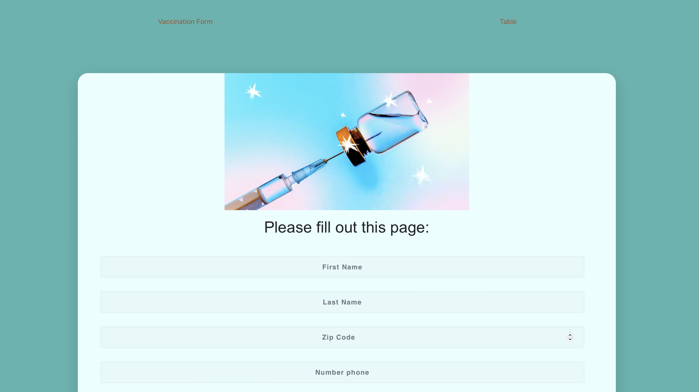

# Vaccination-Esther-Project

 
# <Esther Vaccination Form>

## Description

I have created a website that is composed by a form in order to get vaccinated against COVID , the user should introduce all the personal details in each checkbox . Once all the details have been introduced successfully the information of the user will be saved in the database using the backend.

In order to add the information of each patient we have used the following programs : Django, sql and all the data is written in Pycham for the backend

For the front end I’ve used react and the library of MIU for the table.

I have used many application of react like react component countries in order to access the list of all countries in the world without needed to do any fetch for it

I’ve used anox promise in order to acesss all the data of the database

When we fill the for we can get Teo possible messages either the patient was added successfully or the patient wasn’t added.

Once the POST request have been accepted from the database it will get added to the list and the list is on the table page in the website but it could be access through the sql database or though the console log of json.

I’ve used to check that all request of GET AND POST the postman app that helped a lot on doing the project fixing some errors along the way till we got the 200 response. In order to the table the library MIU offered a wide range of options of filtering every option organizing and much more different options that helps the user to go thought the information

## Table of Contents 

- [Installation](#installation)

FrontEnd:
    Firstly we ought open in terminal `after install` nodejs LTS version 16.15.1
    install `npm install` command
    `npm start` will start the frontend project

BackEnd:
open Backend/settings.py change SECRET_KEY with your own key or a key from this site for example: 1234
change POSTGRSSE NAME and PASSWORD for your own postgrase sever configs,
Once we have changed we have to run python manage.py makemigrations VaccinationApp, and finally python manage.py migrate VaccinationApp
At last we have to run the server: python manage.py runserver

## Usage

    
    
    
    
    

## Credits

For the BackEnd I have used the following video: Python Django + PostgreSQL | REST API Tutorial:

https://www.youtube.com/watch?v=Pwwz4_AvHDU

---

## Features

Export to excel file (CSV)

Framework frontend: React, Node.Js, Bootstrap, MIU, React router,

Framework Backend:  Django , psycopg2( npi install psycopg2), djangorestf (pip install djangorestframework),Django-cors-headers(python -m pip install django-cors-headers), asgiref, Whell, python-sqlparse - Parse SQL statements, pytz - World Timezone Definitions for Python, setupstools

## How to Contribute

If you created an application or package and would like other developers to contribute it, you can include guidelines for how to do so. The [Contributor Covenant](https://www.contributor-covenant.org/) is an industry standard, but you can always write your own if you'd prefer.

